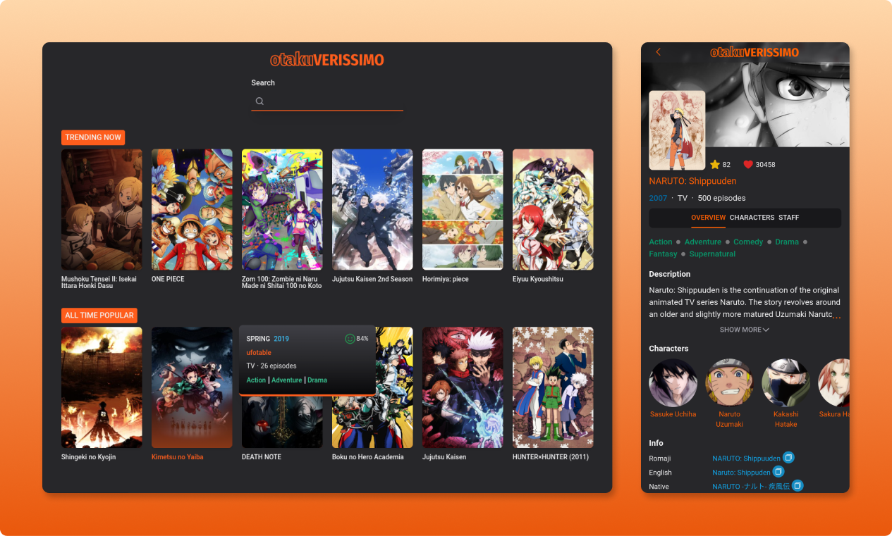

  

<h2>Site published <a href="https://otakuverissimo.vercel.app/">here</a></h2>

## Technologies

This project was developed with the following technologies:

<ul>
  <li>React</li>
  <li>TailwindCSS</li>
  <li>GraphQL</li>
  <li>Typescript</li>
  <li>Phosphor Icons</li>
</ul>

## Project

  Anime and manga website with a vast library of titles and information about them. The aim of this project is to provide users with a centralized place to find information about anime and manga quickly and easily

**
Personal project
**
